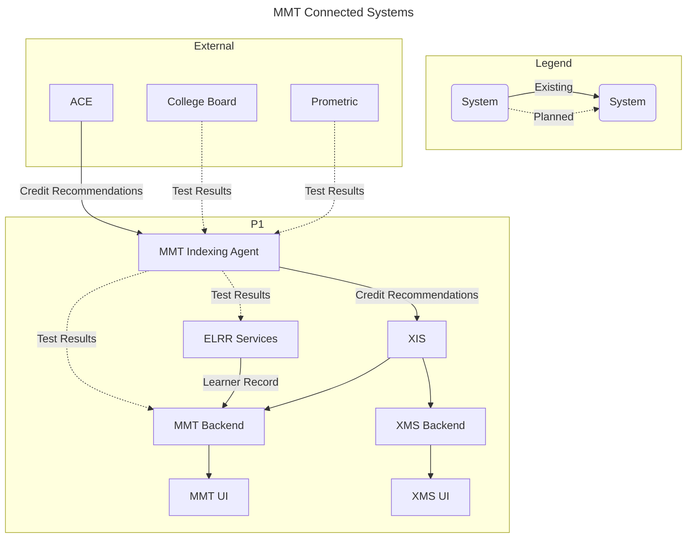

# MMT-Backend
The Modernized Military Transcript (MMT) Backend is the consolidated backend to the human-facing MMT UI application, enabling complex data consolidation from multiple data sources and the generation and sharing of PDF transcripts. Because the MMT Backend is a separate application, it can be deployed in a separate environment from the connected services. It can even be configured to point to different deployments (ELRR, XIS, etc.) as needed. MMT Backend currently provides services to index data from XIS and ELRR Services. 

## Data Flow Diagram



## Environment variables
- The following environment variables are required:

| Environment Variable      | Description                                                                                                                                                                               |
| ------------------------- | ----------------------------------------------------------------------------------------------------------------------------------------------------------------------------------------- |
| BASE_URL                  | URL to use for CSP settings                                                                                                                                                               |
| CELERY_BROKER_URL         | The URL of the message broker that Celery will use to send and receive messages                                                                                                           |
| CELERY_RESULT_BACKEND     | The backend that Celery will use to store task results                                                                                                                                    |
| CORS_ALLOWED_ORIGINS      | A trusted origin for CORS                                                                                                                                                                 |
| CSRF_COOKIE_DOMAIN        | The domain to be used when setting the CSRF cookie. This can be useful for easily allowing cross-subdomain requests to be excluded from the normal cross site request forgery protection. |
| CSRF_TRUSTED_DOMAIN       | A trusted origin for unsafe requests                                                                                                                                                      |
| DB_ENC_PASS               | Password to use for encrypting certain user data in the DB                                                                                                                                |
| DB_HOST                   | The host name, IP, or docker container name of the database                                                                                                                               |
| DB_NAME                   | The name to give the database                                                                                                                                                             |
| DB_PORT                   | The port of the database                                                                                                                                                                  |
| DB_PASSWORD               | The password for the user to access the database                                                                                                                                          |
| DB_USER                   | The name of the user to use when connecting to the database. When testing use root to allow the creation of a test database                                                               |
| DJANGO_SUPERUSER_EMAIL    | The email of the superuser that will be created in the application                                                                                                                        |
| DJANGO_SUPERUSER_PASSWORD | The password of the superuser that will be created in the application                                                                                                                     |
| DJANGO_SUPERUSER_USERNAME | The username of the superuser that will be created in the application                                                                                                                     |
| HOSTS                     | A list of host names, separated by semicolons, that the application should accept requests for                                                                                            |
| LOG_PATH                  | The path to the log file to use                                                                                                                                                           |
| SECRET_KEY_VAL            | The Secret Key for Django                                                                                                                                                                 |

- Optional environment variables:

| Environment Variable | Description                                                                          |
| -------------------- | ------------------------------------------------------------------------------------ |
| S3_BUCKET_NAME       | S3 bucket to pull files from for the Academic Institute Import workflow              |
| STYLE_SHA            | SHA to use for whitelisting CSP style rules                                          |
| TOKEN_LIFE_HOURS     | Set a default expiration time for a Knox API token                                   |
| TOKEN_LIFE_FOREVER   | Disables automatic expiration for Knox API tokens, is overiden by `TOKEN_LIFE_HOURS` |
| TOKEN_COUNT_PER_USER | Limit users to a certain number of tokens each                                       |


## Installation

1. Clone the Github repository:
    - ```git clone https://github.com/adlnet/mmt-backend.git```
    
2. Open terminal at the root directory of the project.
    -  ```example: ~/PycharmProjects/mmt-backend```

3. Run command to install all the requirements from requirements.txt 
    - ```docker-compose build.```

4. Once the installation and build are done, run the below command to start the server.
    - ```docker-compose up```

5. Once the server is up, go to the admin page:
    - http://localhost:8000/admin (replace localhost with server IP)

## Configuration for MMT Backend
1. Navigate over to `http://localhost:8000/admin/` in your browser and log in with the credentials set in the environment variables.

3. <u>CONFIGURATION</u>
    - Configure MMT Backend
        1. Click on `Configuration` > `Add Mmt Configs`
             - Enter ELRR connection information below:
                - Add the `Elrr services api`. This should include any port or pathing prefix.
                - Add the `Elrr api key`. Current capabilities should only need read access from ELRR.
            
             - Enter XIS connection information below:
               - Add the `Xis api`.  This should include any port or pathing prefix.

## Workflows
### ELRR ETL
This workflow loads user data from the configured ELRR instance.  It will create and edit `User Records`, `Military Courses`, `Military Experiences`, and `Military Course Users`.  It can be manually triggered or run on a schedule using the Celery Periodic Task capability.  In order to select this workflow set `Task (custom)` to `workflow_to_load_ELRR_data`.

### XIS ETL
This workflow loads ACE recommendations from the configured XIS instance.  It will create and edit `Academic Course Areas`, `ACE Identifiers`, `Areas and Hours`, and `Military Courses`.  It can be manually triggered or run on a schedule using the Celery Periodic Task capability.  In order to select this workflow set `Task (custom)` to `workflow_to_load_ACE_Credits`.  It can also be triggered by going to `/api/trigger-ace-task/` on the running instance.

### Academic Institute (AI) Import
This workflow loads Academic Institute information from `/opt/imports` and any S3 buckets set in the environment variables.  Both CSV and Excel files (e.g. xlsx) are supported.  The file should be formatted to contain columns labeled `Name` containing the name of the AI, and `Email` for the user's email that should be assigned to the AI.  This will create `Academic Institutes` but will only assign existing `MMT Users` it won't create new ones.  Any `MMT Users` who are already assigned as admins in the AI will have there access revoked.  Users assigned in this way are put in the admin group of the AI, meaning that they are able to add and remove members of the AI.  There is a toggle in the AI `managed by import`, toggling this off will remove the AI from being managed via this process, and will instead have to be manually controlled via the Django Admin.

## Logs
Logging is written to standard output and the file specified by the LOG_PATH environment variable.

## License

 This project uses the [MIT](http://www.apache.org/licenses/LICENSE-2.0) license.
  