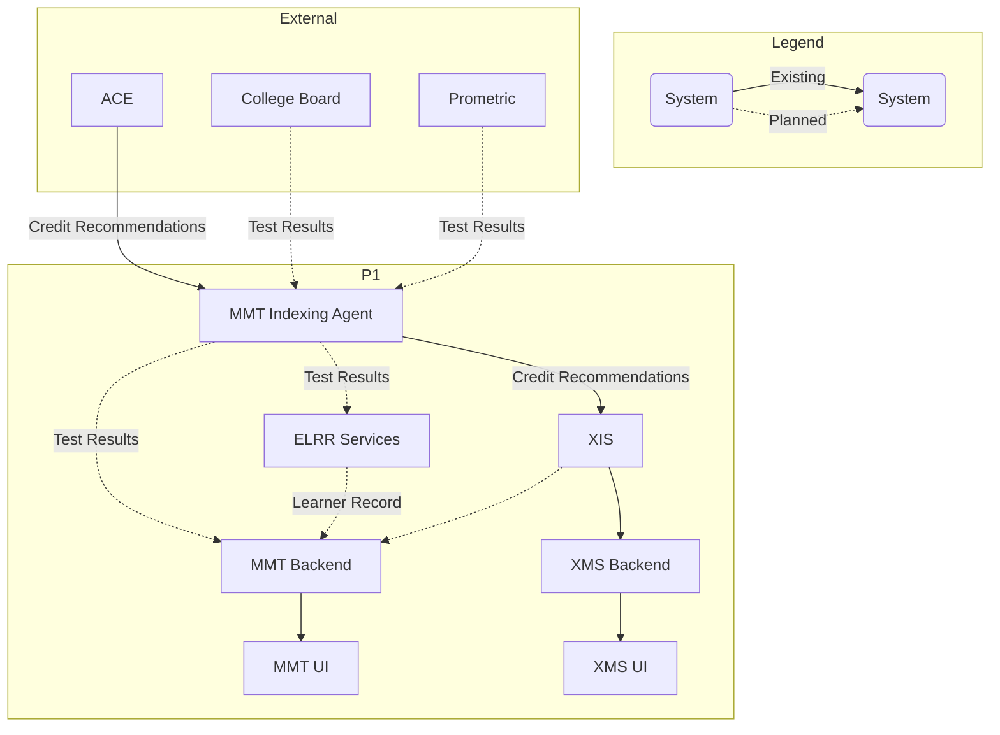

# MMT-Backend

## Data Flow Diagram

```mermaid
graph TD;
        subgraph Legend
                1("System")-->|Existing|2("System");
                1("System")-.->|Planned|2("System");
        end
        subgraph External
                A[ACE];
                CB[College Board];
                P[Prometric];
        end
        subgraph P1
                E[ELRR Services];
                MIA[MMT Indexing Agent];
                M[MMT Backend];
                MMTUI[MMT UI];
                XIS[XIS];
                XMS[XMS Backend];
                XMSUI[XMS UI];
        end
        A-->|Credit Recommendations|MIA;
        CB & P -.->|Test Results|MIA;
        MIA-->|Credit Recommendations|XIS;
        MIA-.->|Test Results|E & M;
        E-.->|Learner Record|M;
        XIS-.->M;
        XIS-->XMS;
        XMS-->XMSUI;
        M-->MMTUI;
```